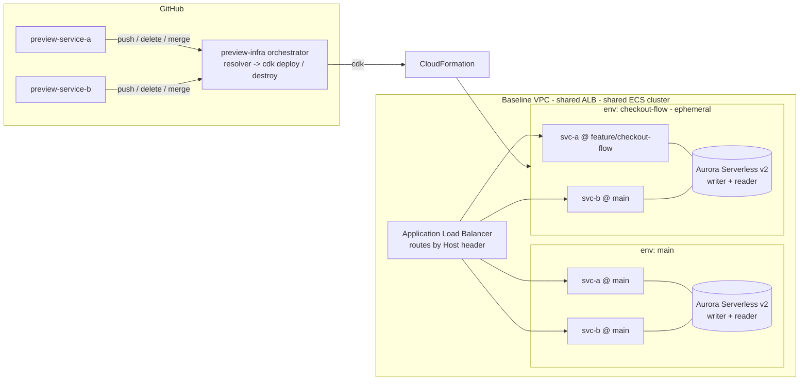

# Architecture

## The problem

Multiple microservices share a database. Features span one or more services, and
today there is a **single shared dev environment**, so feature groups are tested
**sequentially** - they queue, they conflict, deploys slip.

The goal: when a feature branch is pushed, automatically spin up an **isolated,
end-to-end copy** of the whole system (every service + its own database, with a
replica), pairing branches that belong together into one environment, and tear
it all down when the branch is merged or deleted.

## High-level shape



Each environment is a full, isolated copy at the **data + compute** layer. They
share only the *control plane* - one VPC, one ALB, one ECS cluster - which is
what makes spin-up fast and cheap rather than minutes of VPC/NAT churn per PR.

## Components

| Piece | What it is | Where |
|------|-------------|-------|
| **Microservice** | FastAPI + async SQLAlchemy CRUD app, writer/reader split, Dockerized. Same image for both services; `SERVICE_NAME` distinguishes them. | `preview-service-a`, `preview-service-b` |
| **Resolver** | Pure-Python logic mapping open branches -> the set of environments. Fully unit-tested. | `resolver/` |
| **Baseline stack** | VPC, shared ALB, ECS Fargate cluster, ECR repos, and the long-lived `main` environment. | `preview_infra/baseline_stack.py` |
| **Ephemeral env stack** | One per feature group: own Aurora (writer + reader) + both Fargate services + ALB rules. | `preview_infra/ephemeral_env_stack.py` |
| **Orchestrator** | GitHub Actions that runs the resolver and reconciles deployed stacks (deploy desired, destroy orphans). | `.github/workflows/` |

## Feature-group model

One rule produces the whole behaviour:

> **One environment per feature group. Inside it, each repo runs that group's
> branch if it has one, otherwise `main`.**

A branch's group key is its name with a workflow prefix stripped
(`feature/checkout-flow` -> `checkout-flow`), or an explicit `feature-group:<key>`
PR label. Two repos join the same group by using the same branch name (or label).

| Open branches | Resolver output |
|---|---|
| A: `feature/checkout-flow`, B: none | 1 env `checkout-flow` = { a: feature, **b: main** } |
| A: none, B: `feature/search` | 1 env `search` = { **a: main**, b: feature } |
| A & B: `feature/checkout-flow` (same group) | 1 env `checkout-flow` = { a: feature, b: feature } |
| A: `feature/checkout-flow`, B: `feature/search` (different groups) | **2 envs**: `checkout-flow` = { a: feature, b: main } **and** `search` = { a: main, b: feature } |

All four cases fall out of that single rule - see `resolver/feature_groups.py`
and its tests.

## Routing - by Host header

The shared ALB routes by **Host header**: `<slug>-<role>.<base-domain>`, e.g.
`checkout-flow-a.preview.local`. This means one ALB serves unlimited parallel
environments with **no DNS and no path rewriting** - the demo just sends the
header:

```bash
curl -H 'Host: checkout-flow-a.preview.local' http://<alb-dns>/info
```

In production you point a **wildcard DNS record** (`*.preview.example.com`) at the
ALB and add an ACM cert on a `:443` listener; the same hostnames then resolve for
real. Host routing is also the natural place the "header router" concept lives.

## Isolation, teardown & lifecycle

- **Isolation**: each env gets its own Aurora cluster (its own data) and its own
  Fargate services. Nothing is shared except the VPC/ALB/cluster.
- **Teardown**: deleting the `PreviewEnv-<slug>` stack removes the services,
  target groups, listener rules and the Aurora cluster (`RemovalPolicy.DESTROY`,
  automated backups deleted) - no leftovers, no cost.
- **Reconcile, don't react**: the orchestrator recomputes the *desired* set from
  live branches and converges to it (deploy missing, destroy extra). Push,
  delete and merge are all handled by the same idempotent loop, and a scheduled
  **reaper** catches anything a missed webhook would have stranded.

## Database: replication & seeding

- **Engine**: Aurora PostgreSQL **Serverless v2** (0.5-2 ACU). Scales down between
  tests, fast to provision, and gives a managed **reader endpoint** for free.
- **Replica**: every cluster has a `serverless_v2` **reader** instance. Apps read
  from the reader endpoint and write to the writer endpoint, so the replica is
  actually exercised - `/replica-check` writes then reads it back and reports the
  observed lag.
- **Seeding**: services seed sample rows on startup (`SEED_ON_STARTUP=true`) so an
  environment is functional the moment it is green. `app/seed.py` can also run as
  a one-off task for larger fixtures.
- **Locally** the same writer/reader split is mirrored with a real Postgres
  **primary + streaming standby** (`local/docker-compose.yml`).

## Images: two modes

- **`asset`** (default, local/sandbox): CDK builds each image straight from the
  sibling repo's `Dockerfile` during `cdk deploy`. Zero registry plumbing - great
  for the live demo from a laptop. Defaults to **ARM64** (fast, native on Apple
  Silicon; Graviton-cheap on AWS).
- **`ecr`** (CI): the service repos build and push images tagged with the
  slugified branch name; the orchestrator deploys referencing those tags
  (`--context cpu_arch=X86_64` to match amd64 CI runners). No build in the infra
  pipeline.

## Key decisions & trade-offs

| Decision | Why | Trade-off |
|---|---|---|
| Shared VPC/ALB/cluster, per-env DB + services | Fast, cheap spin-up; isolation where it matters (data + app) | Envs share a blast radius at the network layer; fine for preview |
| Aurora Serverless v2 | Managed replica, scale-to-floor between tests | ~$43/mo floor per cluster at 0.5 ACU; mitigated by aggressive teardown |
| Host-header routing | No DNS/cert needed to demo; trivially many envs on one ALB | Need a wildcard DNS record for "real" URLs in prod |
| Reconcile loop over event handlers | Idempotent; one path for push/delete/merge; self-healing | Each event recomputes full state (cheap) |
| Resolver as pure module | Unit-testable with zero AWS; the core logic is provably correct | - |
| One DB shared by both services per env | Models a shared-database microservice setup | Coupled schema ownership (each service owns its own table) |

## Cost notes (sandbox)

The dominant costs are the **NAT gateway** (~$32/mo, baseline) and each Aurora
cluster's **0.5-ACU floor** (~$43/mo while running). Because environments are
torn down on merge/delete and the reaper sweeps orphans hourly, steady-state cost
is just the baseline + however many previews are actually open right now. For an
even cheaper sandbox, set `--context nat_gateways=0` and run app tasks in public
subnets (documented in the README).

## Security notes

- DB credentials are generated into **Secrets Manager** and injected into ECS as
  a secret (never in env files or images).
- App tasks run in **private subnets**; only the ALB is internet-facing.
- Aurora is in **isolated subnets**, reachable only from the app security group.
- Images run as a **non-root** user; ECR scans on push.
- CI authenticates to AWS via **OIDC role assumption** (no long-lived keys).
